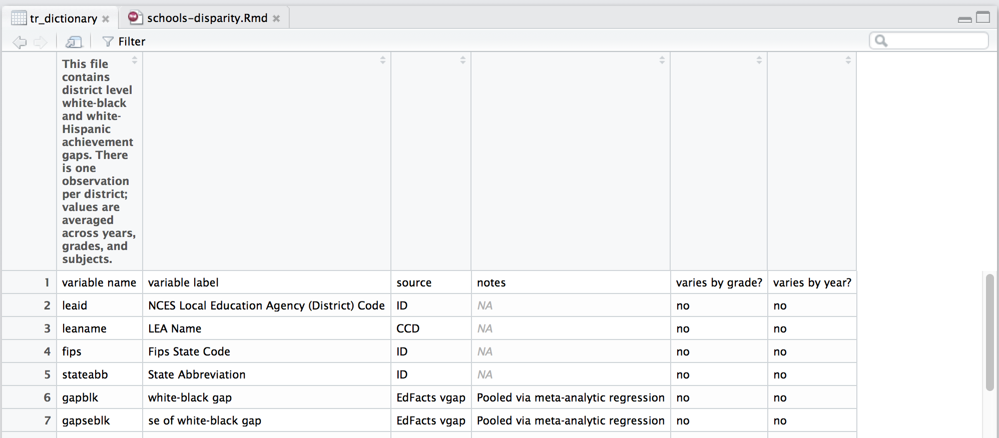
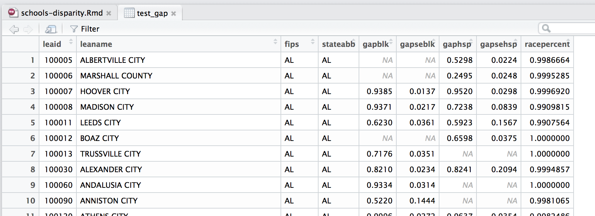

## Case Study Exploration

This analysis is meant to accompany the story [The Problem We All Live With](https://www.thisamericanlife.org/radio-archives/episode/562/the-problem-we-all-live-with) from episode 562 of **This American Life**.

We'll be exploring the test score gaps between black and white students and their relationship with socioeconomic factors such as income and population. The data used in this analysis comes from the [Stanford Education Data Archive](http://news.stanford.edu/2016/04/29/local-education-inequities-across-u-s-revealed-new-stanford-data-set/).

```{r libraries, warning=F, echo=F, message=F}
library(dplyr)
library(readxl)
library(DT)
```

## Downloading and loading the data

```{r loading_data}
#if(!exists("data/district%20gaps%20(pooled%20year,%20grade%20and%20sub)_v1_1.csv")) {
#  download.file("https://stacks.stanford.edu/file/druid:db586ns4974/district%20gaps%20(pooled%20year,%20grade%20and%20sub)_v1_1.csv", "data/district%20gaps%20(pooled%20year,%20grade%20and%20sub)_v1_1.csv")
#}
test_gaps <- read.csv("data/district%20gaps%20(pooled%20year,%20grade%20and%20sub)_v1_1.csv", stringsAsFactors=F)

#if(!exists("data/codebook_achievement_v1point1.xlsx")) {
#  download.file("https://stacks.stanford.edu/file/druid:db586ns4974/codebook_achievement_v1point1.xlsx", "data/codebook_achievement_v1point1.xlsx")
#}
tr_dictionary <- read_excel("data/codebook_achievement_v1point1.xlsx", sheet=11)

#if(!exists("data/district%20covariates%20from%20acs%20and%20ccd%20master_v1_1.csv")) {
#  download.file("https://stacks.stanford.edu/file/druid:db586ns4974/district%20covariates%20from%20acs%20and%20ccd%20master_v1_1.csv", "data/district%20covariates%20from%20acs%20and%20ccd%20master_v1_1.csv")
#}
covariates <- read.csv("data/district%20covariates%20from%20acs%20and%20ccd%20master_v1_1.csv", stringsAsFactors=F)

#if(!exists("data/codebook_covariates_v1_1.xlsx")) {
#  download.file("https://stacks.stanford.edu/file/druid:db586ns4974/codebook_covariates_v1_1.xlsx", "data/codebook_covariates_v1_1.xlsx")
#}
cv_dictionary <- read_excel("data/codebook_covariates_v1_1.xlsx", sheet=1)

```

Researchers at Stanford gathered up data to compare communities' test scores with their socioeconomic qualities.

The data sets we've downloaded and created are covariates and test_gaps. We've also downloaded their accompanying data dictionaries.

Let's take a tour of the data we've downloaded, starting with `test_gaps`.

```{r exploring_structure1}
str(test_gaps)
```

**Note:** We're looking specifically at data pulled from the 11th sheet of the Excel workbook file. Some things Excel does well and we'll continue to use it when it's the fastest option.

OK, this `test_gaps` dataframe has 12 variables (columns) and 11,978 observations (rows).

It looks like each row represents a different school district.

What do those variable names mean, like `leaid` and `gapblk`?

Well, open up the data dictionary file `tr_dictionary` either by clicking the grid on the right of it in the **Environment** tab or typing `View(tr_dictionary)`.



Alright, we know that `gapblack` is **white-black gap** and other notes like the metric was "Pooled via meta-analytic regression". And `leaid` is the code for the District— which will be important for us to use later when we're joining different data sets.

## Test gaps data exploration

Let's do some quick summaries. Which states have the highest gaps?

We're going to use the `dplyr` package. It simplifies wrangling data by using verbs.

Let's take a quick look at the `test-gaps` dataframe.



The columns we want to play around with are `stateabb` and `gapblk`.

We'll also be using the `DT` library so we can present these tables of data easier. It will be easier for us to search and will add pagination to tables for a much better presentation.

```{r summary_state_gap} 
library(DT)

state_gap_summary <- test_gaps %>%
  group_by(stateabb) %>%
  summarise(average_gap = mean(gapblk, na.rm=T)) %>%
  arrange(-average_gap)

datatable(state_gap_summary)
```

It looks like DC, Vermont, and Maine have some of the largest gaps between white and black test scores.

That's interesting by itself, sure, but not enough. We've figured out the average gap by state but **compared to what?** aside from each other?

That's what we've got the covariates of demographic information for.

## Covariates data exploration

Let's see if there's any sort of relationship between the gaps and anything else we can find.

Let's take a look at the structure of the covariates dataframe. 

```{r covariate_explore`}
str(covariates)
```

Wow, alright, that's a lot of variables.

Check out `View(cv_dictionary)` and you'll see the definitions of more than 160 different factors measuring demographics in a school district. 

Which of these should we compare to the gaps to see if there's a correlation? 

What socioeconomic factors of a school district might affect the gap between scores based on what you've heard in the TAL podcast?

Think like a scientist. Come up with a list of ideas and test them.

Alright, now think...

Done? Did you come up with **income level** and **level of integration**? Great!

If you search through the `cv_dictionary` you can see those variables are called `incVblkwht` and `hswhtblk`.

Let's do some more summaries.

```{r covariates_summary1}
cv_summary <- covariates %>%
  group_by(stateabb) %>%
  summarise(avg_income_gap=mean(incVblkwht, na.rm=T), avg_segregation_score=mean(hswhtblk, na.rm=T)) %>%
  arrange(-avg_income_gap)

datatable(cv_summary)
```

It's difficult to come to any conclusions with this data, right?

Even if you know that the higher the number in the `avg_income_gap` column, the higher the gap, and the smaller the number in the `avg_segregation_score`, the less the segregation, it's still hard to see what it all means. We know DC and Minnesotta have the largest income gaps and that DC and Louisiana are segregated the most, but that's it.

We want to compare them to the test scores. 

Let's join them together.

```{r join}
summary_all <- left_join(cv_summary, state_gap_summary)
datatable(summary_all)
```
OK, we're getting somewhere closer. But nothing is jumping out at us.

That's why we need to do some exploratory data visualization.

Let's make a scatterplot comparing the gap in test scores to gap in income.

We'll use the `ggplot2` library.

```{r ggplot2-1, fig.width=9, fig.height=7}
library(ggplot2)

ggplot(summary_all, aes(average_gap, avg_income_gap)) + geom_point()

```
That's a pretty strong chart. The wider the income gap of school districts in a state, the wider the test score gap.

The correlation coefficient is `r cor(summary_all$avg_income_gap, summary_all$average_gap, use="complete")` (you can figure this out by typing `cor(summary_all$avg_income_gap, summary_all$average_gap, use="complete")`)

There are a few outliers, like Vermont, where the test score gap isn't quite as high as the ingome gap.

How about the other factor that measured segregation?

```{r ggplot2-2, fig.width=9, fig.height=7}

ggplot(summary_all, aes(average_gap, avg_segregation_score)) + geom_point()

```

Well, this chart is less convincing.

It only has a correlation coefficient of `r cor(summary_all$avg_segregation_score, summary_all$average_gap, use="complete")` (`cor(summary_all$avg_segregation_score, summary_all$average_gap, use="complete")`).

This is just the beginning, though.

You could write a script to go through each of the factors in the `covariates` dataframe and compare them to the factors in the `test_gaps` dataframe. Or you could try to write a model that predicts the success of students based on those factrs (You'll be walking in the footsteps of those who've done [lots of work](http://news.stanford.edu/2016/04/29/local-education-inequities-across-u-s-revealed-new-stanford-data-set/) on this topic already).

Also, the premise of the podcast episode was that Black students improve after moving to a less segregated school. The data we looked at was for a single year. We'd need test scores for a set of students before and after they move to a less segregated score to directly answer those questions. The one we just did was merely a superficial state-by-state snapshot. 

But this exercise was to get you to think about answering questions and test ideas with data and some functions in R using `dplyr` and `ggplot2`.

Before we go, let's clean up the charts a little bit. 

Every chart needs these aspects.

* Clean
* Clear labels
* A headline
* Sub title for context if necessary
* Source tag
* Byline

```{r ggplot2-3, fig.width=9, fig.height=7}

gg <- ggplot(summary_all, aes(average_gap, avg_income_gap)) + geom_point()
gg <- gg + labs(x="Average test score gap", y="Average income gap", title="White and Black test score gaps compared to income gaps", subtitle="By school districts",
                caption="SOURCE:Stanford Education Data Archive\nAndrew Ba Tran")
gg <- gg + theme(panel.border=element_blank())
gg <- gg + theme(panel.grid.minor=element_blank())
gg <- gg + theme_minimal()
gg

gg <- ggplot(summary_all, aes(average_gap, avg_segregation_score)) + geom_point()
gg <- gg + labs(x="Average test score gap", y="Average segregation score", title="White and Black test score gaps compared to level of segregation", subtitle="By school districts",
                caption="SOURCE:Stanford Education Data Archive\nAndrew Ba Tran")
gg <- gg + theme(panel.border=element_blank())
gg <- gg + theme(panel.grid.minor=element_blank())
gg <- gg + theme_minimal()
gg
```


