Importing different data sets, calculations

Goal: Dealing with Excel files, analyzing data, adjusting for population.

Donald Trump promised to save America from the hellish wave of crime and disorder in his inaugural address.

"The crime and the gangs and the drugs that have stolen too many lives and robbed our country of so much unrealized potential," said President Trump. "This American carnage stops right here and stops right now."

A statement on the White House website lays out the foundation for their claims.


The Trump adminstration alleges that

* In 2015, homicides increased by 17% in America’s fifty largest cities
* That’s the largest increase in 25 years
* In our nation’s capital, killings rose by 50 percent over the past four years
* There were thousands of shootings in Chicago last year alone

Trump does not have a great track record when it comes to [accurate representation](https://www.washingtonpost.com/graphics/politics/2016-election/trump-charts/) of data.

So think like a journalist. 

Is this true? How can it be verified? 

With data on homicides. Where can we get that data?

Reframe that question.

Who would collect data on homicides and why? (Think local then go wider.)

* Police departments
    + To arrest those responsible
* City governments
    + To track population, public policy adjustments
* Local news media
    + To report on events that affect the public
* The Justice Department
    + To track local, regional, state trends
* The Federal Bureau of Investigation
    + To track local statistics
* Insurance, real estate companies, businesses
    + To measure risk and likelihood of crime in an area to set rates

How can you get the data from them?

* Call them up
* Check online
* File a FOIA request

Let's use the FBI's Uniform Crime Reporting Statistics

They've collected data from police departments across the country for decades.

Each year they create a new report. However, their overall [table builder tool](https://www.ucrdatatool.gov/) that lets people pull data across several years only goes up to 2014. It doesn't have the latest 2015 data.

But that's alright for now.

To verify this first claim "In 2015, homicides increased by 17% in America’s fifty largest cities" we need the 2015 and 2014 data to compare to each other.

We'll need a list of the 50 largest cities and we'll need homicide totals from 2014 and 2015 to measure the percent change.

The 2015 data is [here](https://ucr.fbi.gov/crime-in-the-u.s/2015/crime-in-the-u.s.-2015) and the 2014 data is [here](https://ucr.fbi.gov/crime-in-the-u.s/2014/crime-in-the-u.s.-2014).

It's not the most intuitive site to navigate, so I'll point you in the right direction.

Click the 'Download Excel' sheet on [Table 8](https://ucr.fbi.gov/crime-in-the-u.s/2015/crime-in-the-u.s.-2015/tables/table-8/table_8_offenses_known_to_law_enforcement_by_state_by_city_2015.xls/view) of the 2015 data and save it to your **data** folder.

Do the same for the 2014 data on [Table 8](https://ucr.fbi.gov/crime-in-the-u.s/2014/crime-in-the-u.s.-2014/tables/table-8/Table_8_Offenses_Known_to_Law_Enforcement_by_State_by_City_2014.xls/view).

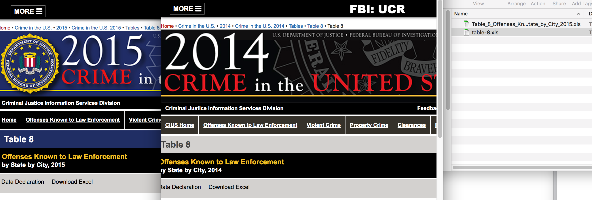

Let's load them in and see what they look like.

We'll use the [**readxl**](https://github.com/hadley/readxl) package.

```{r reading_data, message=F, warning=F}
library(readxl)
h2014 <- read_excel("data/table-8.xls", sheet=1)
```


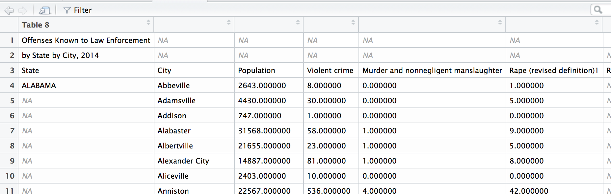

Problems, right? 

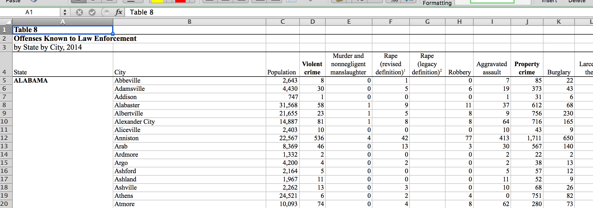

It's not the tidy data structure we're used to working with in R.

There are too many cells with NAs.

We have to clean it up.

```{r reading_data2, message=F, warning=F}
#Fortunately, we can tell the read_excel() function to skip to a certain row when bringing in data

h2014 <- read_excel("data/table-8.xls", sheet=1, skip=3)
```

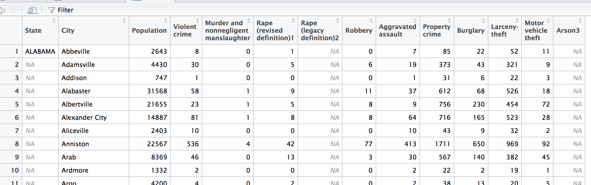
The columns have been named correctly, but it's good practice to change column names so they're syntactically valid. This means no spaces or odd characters.

To do that, use the **make.names()** function.

```{r reading_data3}
colnames(h2014) <- make.names(colnames(h2014))
```

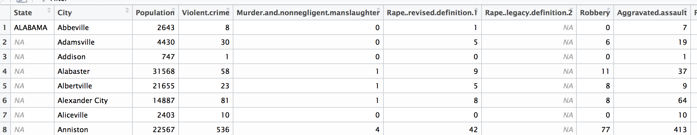

But now we need to replace the `NA`s in the **State** column.

There might be a quicker way to do it, but for now, I'm going to show you a quick loop to do it.

```{r reading_data4}
# What this loop does

# For every row between 1 and the the total number of rows in h2014 dataframe
for (i in 1:nrow(h2014)) {
  
  # If the cell in State is blank,
  if(is.na(h2014$State[i])) {
    # Then fill it with the value of the State cell previous to it
    h2014$State[i]<-h2014$State[i-1]
  } 
}

#This way the cell will be filled with the last value, which logically, is the state identifier.
```


Now, let's do this to the 2015 data by judge adjusting the code from above.

```{r reading_data5}
h2015 <- read_excel("data/Table_8_Offenses_Known_to_Law_Enforcement_by_State_by_City_2015.xls", sheet=1, skip=3)

colnames(h2015) <- make.names(colnames(h2015))

# For every row between 1 and the the total number of rows in h2015 dataframe
for (i in 1:nrow(h2015)) {
  
  # If the cell in State is blank,
  if(is.na(h2015$State[i])) {
    # Then fill it with the value of the State cell previous to it
    h2015$State[i]<-h2015$State[i-1]
  } 
}
```

Great, we've got two data sets with homicides for all cities across the country.

Let's narrow the 2015 data down to the 50 largest cities (Fortunately, the data includes population). And then we'll join it to the 2014 data.

We'll use the **dplyr** package.

```{r population_filter, warning=F, message=F}
library(dplyr)

# Arranging by population in descending order
h2015 <- arrange(h2015, desc(Population))

# Grabbing just the first 50 cities
h2015_50 <- h2015[1:50,]

# Prepping the two dataframes for joining
h2015_50 <- select(h2015_50, State, City, Homicides2015=Murder.and.nonnegligent.manslaughter)
h2014 <- select(h2014, State, City, Homicides2014=Murder.and.nonnegligent.manslaughter)
h2015_joined <- left_join(h2015_50, h2014, by=c("State", "City"))
```

Did that work?

```{r top5}
head(h2015_joined)
```

Hm, it didn't join successfully on some. What's up with that?

Let's take a look at what's going on in New York.

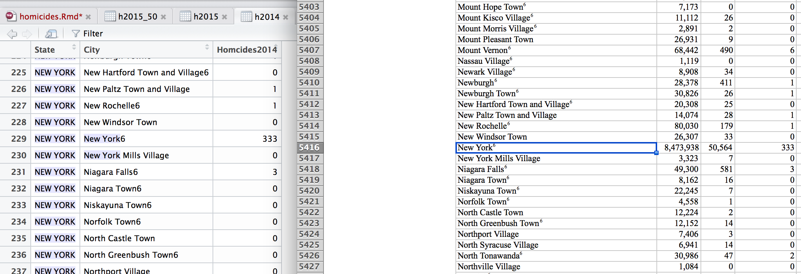

It looks like a number of the data points have footnote numbers (Dammit, Excel!)

We have to use regex to clean out those numeric characters.

```{r more_cleaning}
# This library a function I'll use to trim trailing spaces
library(stringr)

# These commands get rid of numbers and commas
h2014$City <- gsub('[0-9]+', '', h2014$City)
h2014$City <- gsub(',', '', h2014$City)
h2014$City <- str_trim(h2014$City)

h2014$State <- gsub('[0-9]+', '', h2014$State)
h2014$State <- gsub(',', '', h2014$State)
h2014$State <- str_trim(h2014$State)

# Now let's try to bring the 2015 and 2014 dataframes together again
h2015_joined <- left_join(h2015_50, h2014, by=c("State", "City"))
```

Alright, how many `NA` cells are there now? We can check by typing `sum(is.na(h2015_joined$Homicides2014))` and we'll know there are `r sum(is.na(h2015_joined$Homicides2014))` blank values.

Why is that?

Well, I won't make you dig around further, but if you did, you'd see that it was because most of those cities weren't in both years.

As in Fort Worth had data for 2015 but not for 2014.

In all, Honolulu, Fort Worth, Tucson, and Wichita were not present and thus could not be successfully joined.

Nashville was present in both data sets but did not join successfully because in 2015, officials called it "Nashville Metropolitan" while in 2014, it was called just "Nashville".

**This is the frustrating thing about working with data.** 

**It can be incomplete or inconsistent and takes a long time to prepare it before we can analyze it.**

OK, let's do what we can.


```{r more_cleaning2s}
# We can at least fix Nashville quickly

h2014$City <- gsub('Nashville', 'Nashville Metropolitan', h2014$City)

# Now let's try to bring the 2015 and 2014 dataframes together again
h2015_joined <- left_join(h2015_50, h2014, by=c("State", "City"))
```

Alright, we're down to just four missing cities.

Let's do some math knowing the data is incomplete just for fun.

```{r math1}
total_homicides_2014 <- sum(h2015_joined$Homicides2014, na.rm=T)
total_homicides_2015 <- sum(h2015_joined$Homicides2015, na.rm=T)

# Percent change

percent_change_2015 <- round((total_homicides_2015- total_homicides_2014)/total_homicides_2014*100,2)
```

So with four towns missing, there were `r total_homicides_2014` homicides in 2014 and `r total_homicides_2015` homicides in 2015. 

That's a percent change of `r percent_change_2015`, which is close to the 17 percent that Trump alleges. But with homides missing from four towns, the percent change is exaggerated.

Let's try it one more way and try to make it as complete as possible.

```{r more_cleaning3}
# Let's filter to the largest 50 cities that have both 2014 and 2015 data

h2015 <- select(h2015, State, City, Population, Homicides2015=Murder.and.nonnegligent.manslaughter)
h2015_joined <- left_join(h2015, h2014, by=c("State", "City"))
h2015_joined <- filter(h2015_joined, !is.na(Homicides2014))
h2015_joined <- h2015_joined[1:50,]
```

Let's try the math again.

```{r math2}
total_homicides_2014 <- sum(h2015_joined$Homicides2014, na.rm=T)
total_homicides_2015 <- sum(h2015_joined$Homicides2015, na.rm=T)

# Percent change

percent_change_2015 <- round((total_homicides_2015- total_homicides_2014)/total_homicides_2014*100,2)
```

Alright, using complete data, the percent change in homicides between 2014 and 2015 is `r percent_change_2015`— which is an increase, but not as high of an increase as Trump alleges.

Also, what happens when you include all the matched town data and don't limit it to the 50 largest cities? The percent change is 14.34.

# Is that the largest in 25 years?

To look into this other allegation, we can finally use the FBI's [table-building tool](https://www.ucrdatatool.gov/).

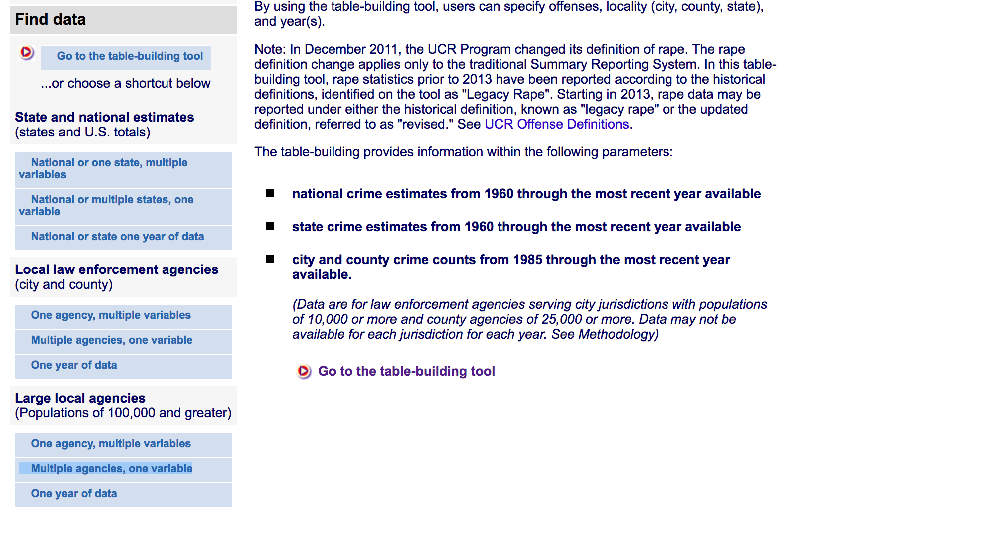

Click **Multiple agencies, one variable** under the **Large local agencies** section.

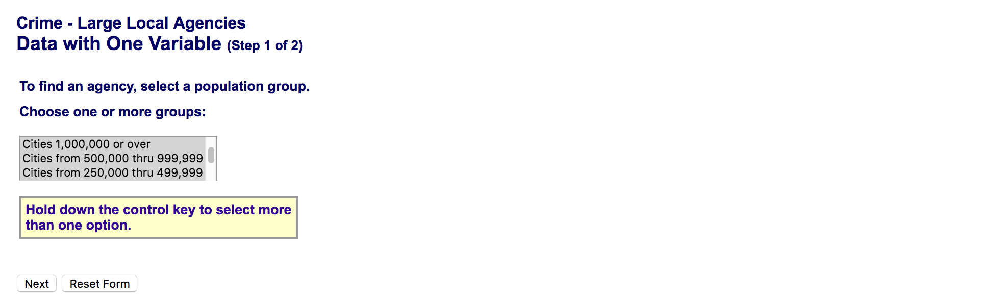

Click the **Next** button.


* Select all the agencies in the menu on the left (command+A or ctrl+A)
* Choose **Murder and nonnegligent manslaughter** in the pull down menu
* Pick 1990 to 2014 (which is 24 years total)
* Click **Get Table**

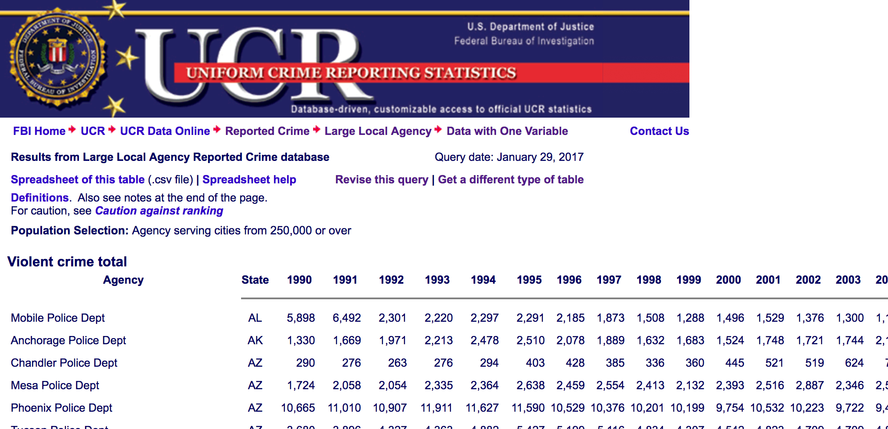


OK, get that data by left clicking and saving the link in **Spreadsheet of this table**.

Move that file over to your data folder and load it into R.

Let's take a quick look at the structure before bringing it in.

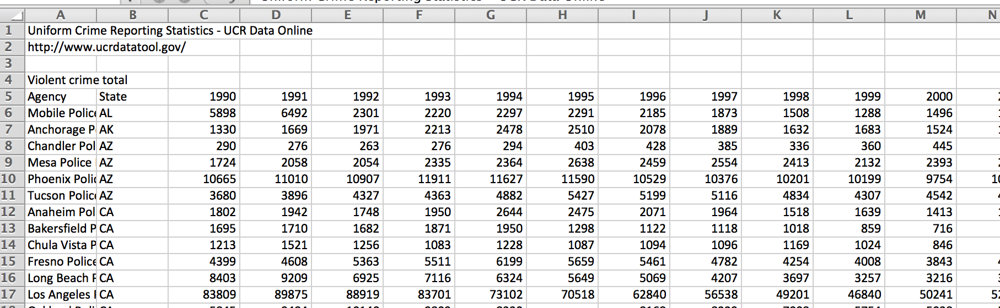

When we bring it in, we'll need to skip the first few rows again.


```{r loading_fbi}
trends <- read.csv("data/LocalCrimeTrendsInOneVar.csv", stringsAsFactors=F, skip=4)
```

Looks like that worked except:

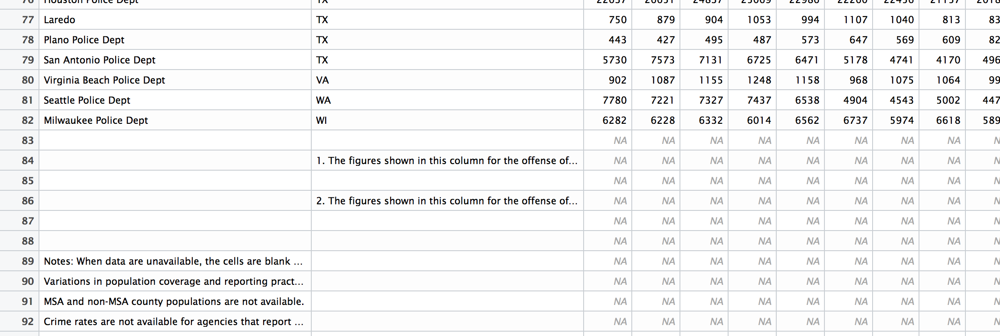

We can filter that out.

```{r loading_fbi2}
trends <- trends[1:82,]

# Also, let's get rid of that floating blank column at the end
trends$X <- NULL
```

Let's figure out the percent change between each year.

We'll use the **tidyr** package so we can restructure the data so it's easier to figure out the total homicides per year.

```{r wrangling}
library(tidyr)

re_trends <- trends %>%
  gather("year", "homicides", 3:27) %>%
  group_by(year) %>%
  summarize(total=sum(homicides, na.rm=T))

library(knitr)
kable(re_trends)
```

Alright, we're getting somewhere.

We need to clean it up a bit and figure out the percent change year to year, first. 

And then we can try to visualize it.

```{r year_to_year, fig.width=8, fig.height=5}
re_trends$year <- gsub("X", "", re_trends$year)

# There's probably a faster way to do this, but I'm going to make a loop to determine the percent change for each row.

re_trends$percent_change <- 0

for (i in 2:nrow(re_trends)) {
  re_trends$percent_change[i] <- round((re_trends$total[i]-re_trends$total[i-1])/re_trends$total[i-1]*100,2)
}

library(ggplot2)

ggplot(re_trends, aes(x=year, y=percent_change)) +geom_bar(stat="identity")
```

Well, even though we're not comparing the same cities, we can get a general sense of percent change year to year. 

According to that measurement, yes, the percent change between 2014 and 2015 of `r percent_change_2015 ` is higher than any other year since 1990.

But that number is misleading. 

Why?

Check out the overall trend of raw numbers in these cities.

```{r year_to_year_total, fig.width=8, fig.height=5}
ggplot(re_trends, aes(x=year, y=total)) +geom_bar(stat="identity")

```

As we can all see, focusing on percent year to year takes away from the larger picture, which is that homicides is on an overall downward trend and has been since the '90s.

# Homicides in Washington DC

"In our nation’s capital, killings rose by 50 percent over the past four years."

Is that true? 

According to the 2015 data, the number of homicides was 165. Four years earlier, it was 88.

That's about an 88 percent increase, it's true.

But once again, why focus on four years?

Let's look at the data.

```{r dc, fig.width=8, fig.height=5}

dc <- filter(trends, State=="DC") %>%
  gather("Year", "Total", 3:27) 

# Adding the 2015 data
dc <- rbind(dc, data.frame(Agency="Washington Metropolitan Police Dept", State="DC", Year="X2015", Total=162))
dc$Year <- gsub("X", "", dc$Year)

ggplot(dc, aes(x=Year, y=Total)) +geom_bar(stat="identity")

```
Because four years ago, DC had the lowest number of homicides in decades. So if you want to exaggerate the change between now and then, you pick the then with lowest point.

Is there an uptick in homcides? Sure. But that's only happened very recently.

# Chicago homicides

"There were thousands of shootings in Chicago last year alone."

You known what we're going to do.

Same thing as with DC but for Chicago.

```{r chicago, fig.width=8, fig.height=5}
chi <- filter(trends, Agency=="Chicago Police Dept") %>%
  gather("Year", "Total", 3:27) 

# Adding the 2015 data
chi <- rbind(chi, data.frame(Agency="Chicago Police Dept", State="IL", Year="X2015", Total=478))
chi$Year <- gsub("X", "", chi$Year)

ggplot(chi, aes(x=Year, y=Total)) +geom_bar(stat="identity")
```

The FBI doesn't track shootings, only homicides.

We'd need to get that data from the Chicago Police themselves, most likely.

So, it's true that shootings are in the ["thousands"](http://crime.chicagotribune.com/chicago/shootings/) but in relation to what? 

We know for sure that deaths are going down in Chicago. It's most likely that shootings have gone down, too.

We'll only know for sure if we have the data.

Also, why the fixation on Chicago? Is that fair? Sure they have a lot of shootings and deaths, but the city is also a large population.

Let's check that real quick with the 2015 data since that data set includes both total and population.

```{r per_capita}
library(DT)

h2015b <- select(h2015, State, City, Population, Homicides2015) %>%
  filter(!is.na(City)) %>%
  filter(Population>100000)

h2015b$per_capita <- round(h2015b$Homicides2015/h2015b$Population*100000,2)

h2015b <- arrange(h2015b, desc(per_capita))
datatable(h2015b)

```
St. Louis and Baltimore and many other cities actually have higher homicides per 100,000 residents than Chicago.

Chicago's actually 25th compared to all the other cities. Even Hartford has a higher rate of homicides.

What's the lesson in all this?

It's not that difficult to verify claims when the data is easily available. 

The hardest part was just cleaning up the data to get apples-to-apples data.
