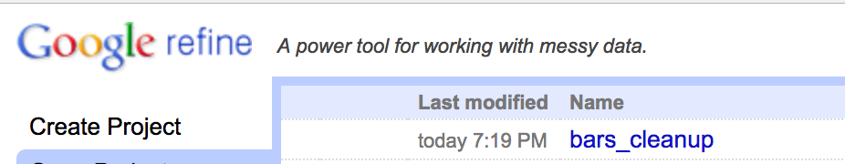
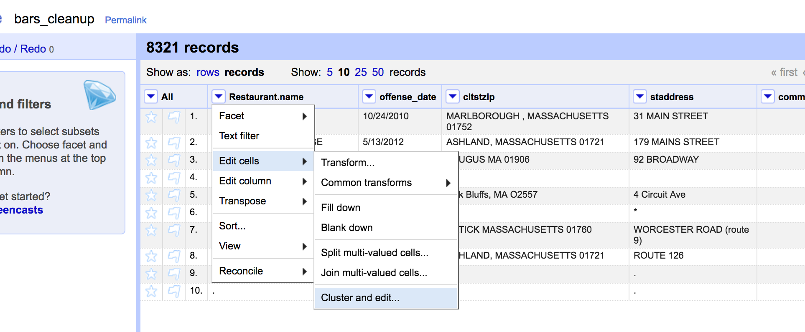
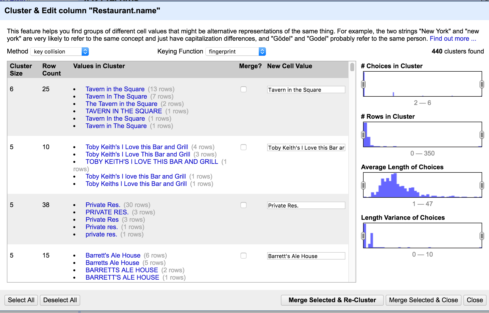
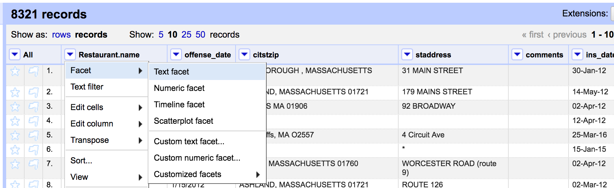
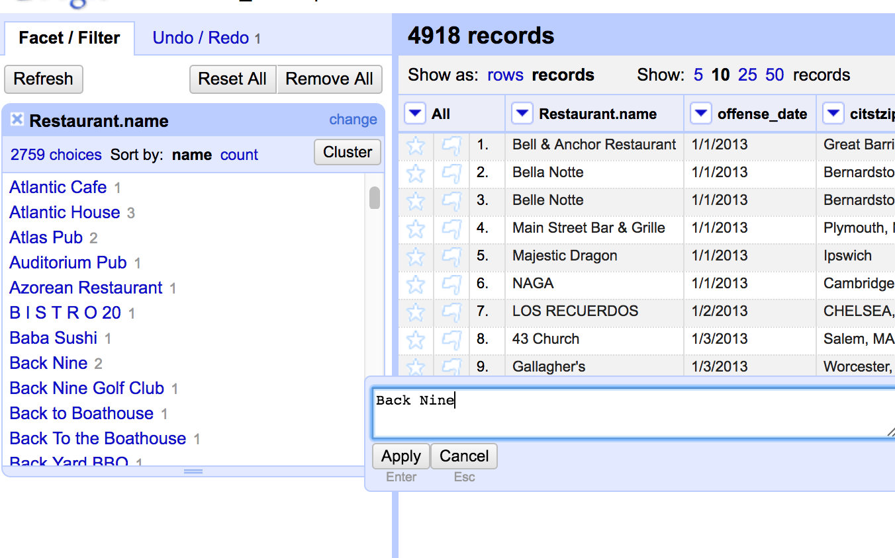

An exercise in cleaning data with R.

We'll be using OpenRefine in conjunction with R.

We'll be replicating the analysis that went into the story: [The bars where drivers got drunk before OUI arrests](https://www.bostonglobe.com/business/2016/12/31/the-bars-where-drivers-got-drunk-before-their-oui-arrests/6pJV2qmcYExUz4SLEdPjoI/story.html) by Dan Adams and Matt Rocheleau.

**Note:** This data is property of The Boston Globe and is meant to be used for research purposes only and not for publication.

Let's load the data in and take a look at what we're working with

```{r loading}
bars <- read.csv("https://docs.google.com/spreadsheets/d/15TJZhuh7jKoO9fDr8LIcBr8T3vf_sUJudBD9L5o0rDM/pub?output=csv", stringsAsFactors=F)
library(knitr)
kable(head(bars,10))
```
This is definitely one of those problematic data sets.

Restaurant names are out of sync, sometimes there's a dot or a star where there's no data. Instead of `NA` it might be "n/a".

The addresses are inconsistent. SOmetimes they have the state abbreviated, sometimes it's spelled out. Sometimes it's just a road.

I don't have a lot of confidence in the consistency in the names, either.

Let's take a peek.

```{r peek}
library(dplyr)

restaurants <- bars %>%
  group_by(Restaurant.name) %>%
  summarize(Total.Incidents=n()) %>%
  arrange(desc(Total.Incidents))

kable(head(restaurants,10))
```
It looks like there are multiple ways to spell out private residences, among probably many more off spellings or casings or abbreviations.

Count how many different Restaurant names there with the command `length(unique(bars$Restaurant.name))`.

So, `r length(unique(bars$Restaurant.name))`. Let's see if we can make that number smaller.

# Fuzzy matching

We're going to use a package called [**rrefine**](https://github.com/vpnagraj/rrefine). 

It's pretty much a wrapper for [OpenRefine](http://openrefine.org/), which used to be known as Google Refine.

First, let's install and open [OpenRefine](http://openrefine.org/). It runs in a browser off your system (You'll need to make sure you've got the latest version of Java installed)

```{r refine1}

# install.packages("devtools")
devtools::install_github("vpnagraj/rrefine")
library(rrefine)

# You'll write the CSV to your computer
write.csv(bars, file = "data/bars.csv", row.names = FALSE)

# And then upload that file to the OpenRefine program
refine_upload(file = "data/bars.csv", project.name = "bars_cleanup", open.browser = TRUE)
```

This will take a minute or two to load, depending on the size of the file.

But you'll see a new tab pop open pointing at *127.0.0.1:333* with the project name at the top.



Click on that.

Alright, from here, let's clean things up a bit.

Jump right in and click on the blue arrow next to the **Restaurant.name** column header and select **Edit cells > Cluster and edit....**





OpenRefine uses a handful of methods and keying functions to detect when a string might match another.

It clusters them together and then by checking the **Merge?** box next to it, it will turn the strings on the left into the string on the right in **New Cell Value**. You could manually change that if you like, but it guesses the one you'll most likely choose by picking the one with the most instances.

Go down through the 440 clusters one by one and cluster them.

You'll see that *Toby Keith's* could also be called *Toby Keith's I Love this Bar and Grill*

So fill that in with the full-length name when you come across it.

Others: Fridays = TGI Friday's.

Takes forever, right?

You could click the **Select All** button on the bottom right, if you want.

But that's the benefit of using OpenRefine, there's more control and you can see patterns that the machine can't.

**We'll go over how to use a function to go over this, but once again, it's not going to be as exacting as you are with this method**.

Go through all the Methods and Distance Functions in the pulldown menus at the top to ensure you've got everything covered.

You have a lot of data so it'll take a long time to cluster through each pulldown.

## Another level of cleaning in OpenRefine

Let's go further by selecting the the triangle next to **Restaurant.name** and choose **Facet > Text facet**.



This way you can look at the names alphabetically to see if you missed anything.


If you want to change one of them, just hover over the name and click on the **edit** link. 



And the text will be updated and the count will be refreshed.

This way you'll spot more obvious similar names than the algorithm did.

It's a long process. I got partway through the B's before I stopped.

Let's see how far along we've gotten, though.

Bring the project back into R.

```{r openrefine_import}


# I have to rename this file because running this file creates a new file and bringing it back in confuses this packages since then there would be two "bars_cleanup" files

# In short, use the uncommented version of the command below and ignore the one with "bars_cleanup2" since that won't work for you.

# bars_clean <- refine_export(project.name = "bars_cleanup")

bars_clean <- refine_export(project.name = "bars_cleanup2")

length(unique(bars_clean$Restaurant.name))
```

Nice.

We've cleaned up nearly 300 rows.

Another way to do it would be if you had a clean list for the official name of all the restaurants in Massachusetts.

Then you could use the `adist()` [function](https://stat.ethz.ch/R-manual/R-devel/library/utils/html/adist.html) to figure out which bad version of the name approximates to the the good version of the name.

## Splitting up the address column

We need to try to extract the town names from **citstzip** column.

That's going to be very difficult.

```{r addresses}
head(bars_clean)
```


Ok, it looks like we've got Town, State and Zipcode at most. Sometimes it's just the Town. Sometimes it's Town and State.

We want Town, State, and Zipcode to stand alone in their own colulmns.

So, let's do this.

```{r zipcode}
bars_clean$zip <- gsub("[[:alpha:]]", "", bars_clean$citstzip)
head(bars_clean$zip)
```

Close, but still have to get rid of the spaces, commas, and periods.

```{r zipcode2}
bars_clean$zip <- gsub(",", "", bars_clean$zip)
bars_clean$zip <- gsub(" ", "", bars_clean$zip)
bars_clean$zip <- gsub(".", "", bars_clean$zip, fixed=TRUE)
bars_clean$zip <- gsub("*", "", bars_clean$zip, fixed=TRUE)
bars_clean$zip <- gsub("/", "", bars_clean$zip, fixed=TRUE)

head(bars_clean$zip)
```

Nice. 

Alright, let's try to guess what state the addresses have.

```{r state}
bars_clean$state <- ""
bars_clean$state <- ifelse(grepl(" RI", bars_clean$citstzip,  ignore.case = TRUE), "Rhode Island", bars_clean$state)

bars_clean$state <- ifelse(grepl(" MA", bars_clean$citstzip,  ignore.case = TRUE), "Massachusetts", bars_clean$state)
bars_clean$state <- ifelse(grepl("M.A.", bars_clean$citstzip,  ignore.case = TRUE), "Massachusetts", bars_clean$state)

bars_clean$state <- ifelse(grepl(",MA", bars_clean$citstzip,  ignore.case = TRUE), "Massachusetts", bars_clean$state)
bars_clean$state <- ifelse(grepl("MA.", bars_clean$citstzip,  ignore.case = TRUE), "Massachusetts", bars_clean$state)
bars_clean$state <- ifelse(grepl(" NH", bars_clean$citstzip,  ignore.case = TRUE), "New Hampshire", bars_clean$state)
bars_clean$state <- ifelse(grepl("N.H.", bars_clean$citstzip,  ignore.case = TRUE), "New Hampshire", bars_clean$state)

bars_clean$state <- ifelse(grepl("New Hampshire", bars_clean$citstzip,  ignore.case = TRUE), "New Hampshire", bars_clean$state)
bars_clean$state <- ifelse(grepl(" N H", bars_clean$citstzip,  ignore.case = TRUE), "New Hampshire", bars_clean$state)

bars_clean$state <- ifelse(grepl(" CT", bars_clean$citstzip,  ignore.case = TRUE), "Connecticut", bars_clean$state)
bars_clean$state <- ifelse(grepl("Rhode Island", bars_clean$citstzip,  ignore.case = TRUE), "Rhode Island", bars_clean$state)

bars_clean$state <- ifelse(grepl(" VT", bars_clean$citstzip,  ignore.case = TRUE), "Vermont", bars_clean$state)
```

There's no clear way to do this.

Just set up some rules and see if it works.

If it missed some, then add more rules until all of them are caught.

Finally, the town column.

```{r address}
bars_clean$town <- gsub(",.*", "", bars_clean$citstzip)
bars_clean$town <- gsub(" MA.*", "", bars_clean$town, ignore.case=T)
bars_clean$town <- gsub("S.", "South ", bars_clean$town, fixed=TRUE)
bars_clean$town <- gsub("N.", "North ", bars_clean$town, fixed=TRUE)
bars_clean$town <- gsub("W.", "West  ", bars_clean$town, fixed=TRUE)
bars_clean$town <- gsub("E.", "North ", bars_clean$town, fixed=TRUE)

library(stringr)

bars_clean$town <- str_to_title(bars_clean$town)

head(bars_clean[c("zip", "state", "town")],10)
```
Not bad!

It'll take a lot of time, but now we can see the clear steps of what we did.

If you're really set on power cleaning data, then I suggest mastering **Regular Expressions**.

We've done it a few times like `gsub("[[:alpha:]]", "", bars_clean$citstzip)` was a function that got rid of any letters in a string leaving behind numbers and special characters.

There are many great resources. Check [this one](http://www.regular-expressions.info/rlanguage.html) out, if interested.